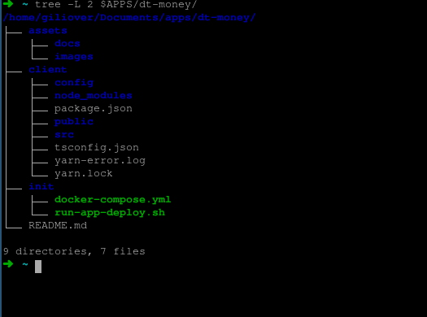

    <header>
        

            <h2>Dt Money</h2>
            

                <a href="#current-state">Current state • </a>
                <a href="#start-docker">Starting project • </a>
                <a href="#techs">Technologies •</a>
                <a href="#historic">Historic </a>
            

        

        

            <h4>✔ Current state</h4>
            
        

    </header>
    

        <h4>✔ Starting project</h4>
        
         
         
    

    <table>
        <tbody id="start-docker">
            <tr>
                <td>
                    

                        <table>
                            <thead>
                                <tr>
                                    <th>Files</th>
                                    <th>Content</th>
                                    <th>About</th>
                                </tr>
                            </thead>
                            <tbody>
                                <tr>
                                    <td>
                                        
 Init /

                                    </td>
                                    <td>
                                        <ol>
                                            <li style="font-size: 0.6rem">run-app-deploy.sh</li>
                                        </ol>
                                    </td>
                                    <td>
                                        <ol>
                                            <li style="font-size: 0.6rem">Application deployment script using the "docker-compose" command run the following command on your konsole 
                                                <table>
                                                    <thead>
                                                        <tr>
                                                            <th>Firt Boot</th>
                                                            <th>Initialized case</th>
                                                        </tr>
                                                    </thead>
                                                    <tbody>
                                                        <tr>
                                                            <td>
                                                                
./run-app-deploy.sh --init-dev

                                                            </td>
                                                            <td>
                                                                
./run-app-deploy.sh --dev

                                                            </td>
                                                        </tr>
                                                    </tbody>
                                                </table>
                                            </li>
                                        </ol>
                                    </td>
                                </tr>
                            </tbody>
                        </table>
                    

                    <strong>Then click here to access:</strong>
                    <a href="http://localhost:3013">port 3000</a>
                </td>
            </tr>
        </tbody>
    </table>
    <table id="techs">
        <h4>✔ Technologies used:</h4>
        <tbody>
            

                <table>
                    <tbody>
                        <tr>
                            <td>
                                <ol>
                                    <li style="font-size: 0.6rem">
                                        </img>
                                    </li>
                                    <li style="font-size: 0.6rem">
                                        </img>
                                    </li>
                                    <li style="font-size: 0.6rem">
                                        </img>
                                    </li>
                                    <li style="font-size: 0.6rem">
                                        </img>
                                    </li>
                                    <li style="font-size: 0.6rem">
                                        </img>
                                    </li>
                                    <li style="font-size: 0.6rem">
                                        </img>
                                    </li>
                                    <li style="font-size: 0.6rem">
                                        </img>
                                    </li>
                                    <li style="font-size: 0.6rem">
                                        </img>
                                    </li>
                                    <li style="font-size: 0.6rem">
                                        </img>
                                    </li>
                                    <li style="font-size: 0.6rem">
                                        </img>
                                    </li>
                                </ol>
                            </td>
                        </tr>
                    </tbody>
                </table>
            

        </tbody>
    </table>
    

        <h4>✔ Historic</h4>
        <table>
            <tbody>
                <tr>
                    <td></td>
                    <td></td>
                    <td></td>
                    <td></td>
                </tr>
            </tbody>
        </table>
    

