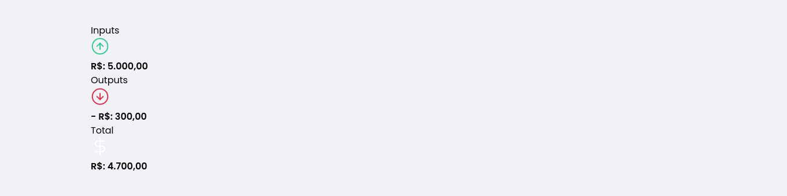
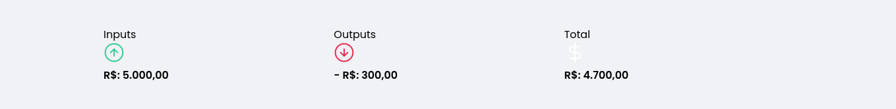
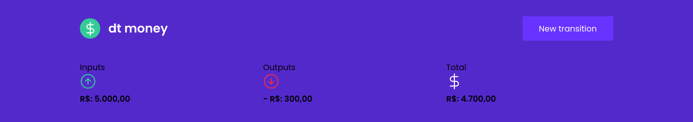
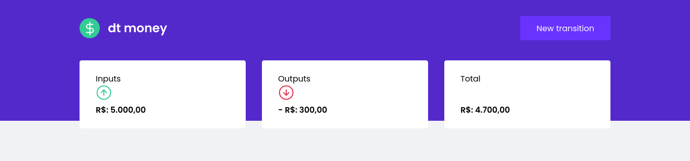
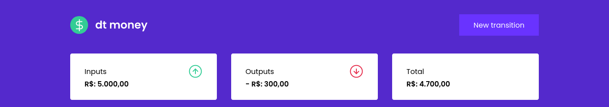
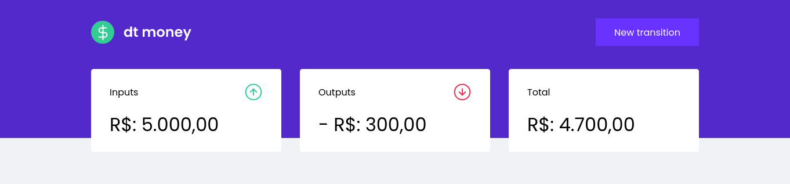
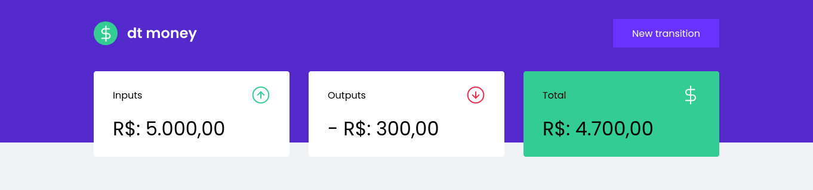

<label><strong>💻 Code: </strong></label>

```jsx
function Summary() {
	return (
		<Container>
			<div>
				<header>
					<p>Inputs</p>
					
				</header>
				<strong>R$: 5.000,00</strong>
			</div>
			<div>
				<header>
					<p>Outputs</p>
					
				</header>
				<strong>- R$: 300,00</strong>
			</div>
			<div className="highlight-background">
				<header>
					<p>Total</p>
					
				</header>
				<strong>R$: 4.700,00</strong>
			</div>
		</Container>
	);
}

export default Summary;

```


```jsx
export const Container = styled.div` 

display:grid;
grid-template-columns: repeat(3, 1fr);
gap: 2rem;
margin-top: -10rem;

div {
	background: var(--shape);
	padding: 1.5rem 2rem;
	border-radius: 0.25rem;
	color: var(--text-title);

	header {
		display: flex;
		align-items: center;
		justify-content: space-between;
	}

	strong {
		display: block;
		margin-top: 1rem;
		font-size: 2rem;
		font-weight: 500;
		line-height: 3rem;
	}

	&.highlight-background {
		background: var(--green);
	}

}

`;
```
<br>
<br>
<label><strong>Before: </strong></label>

<br>
<br>
<br>
<br>
<label>✔ - The <strong>Summary</strong> container was exported with some css styles.</label>
<br>
<label>↪ Using css grid property to split into 3 equal parts </label>

```css
display:grid;
grid-template-columns: repeat(3, 1fr);
```
<br>
<br>
<label><strong>Result: </strong></label>

<br>
<br>

<label>↪ Going up <strong>Summary</strong> Container with <strong>margin-top</strong> property </label>

```css
display:grid;
grid-template-columns: repeat(3, 1fr);
gap: 2rem;
margin-top: -10rem;
```
<br>
<br>
<label><strong>Result: </strong></label>

<br>
<br>

<label>↪ Styling <strong>Summary</strong> content </label>

```css
background:var(--shape);
padding: 1.5rem 2rem;
border-radius: 0.25rem;
color: var(--text-title);

```
<br>
<br>
<label><strong>Result:</strong></label>

<br>
<br>

<label>↪ Styling <strong>Summary</strong> header </label>

```css
header {
	display: flex;
	align-items: center;
	justify-content: space-between;
}

```
<br>
<br>
<label><strong>Result:</strong></label>

<br>
<br>

<label>↪ Styling <strong>Summary</strong> strong </label>

```css
strong {
	display: block;
	margin-top: 1rem;
	font-size: 2rem;
	font-weight: 500;
	line-height: 3rem;
}

```
<br>
<br>
<label><strong>Result:</strong></label>

<br>
<br>

<label>↪ applying green background </label>

```css
&.highlight-background {
	background: var(--green);
}

```
<br>
<br>
<label><strong>Result:</strong></label>

<br>
<br>