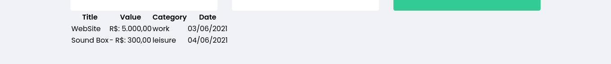
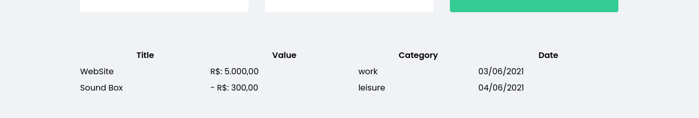
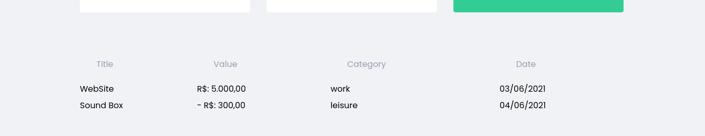
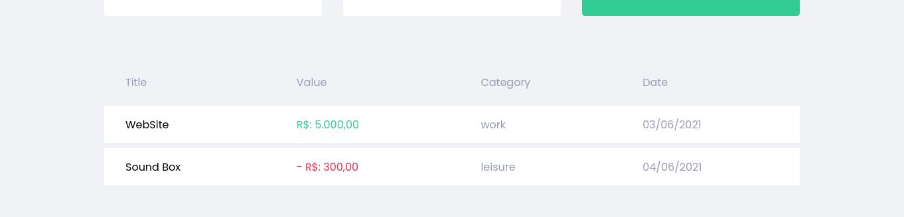

<label><strong>💻 Code: </strong></label>

```jsx
	<Container>
		<table>
			<thead>
				<tr>
					<th>Title</th>
					<th>Value</th>
					<th>Category</th>
					<th>Date</th>
				</tr>
			</thead>
			<tbody>
				{transactions.map((transaction) => (
					<tr key={transaction.id}>
						<td>{transaction.title}</td>
						<td className={transaction.type}>
							{formatValue(transaction.value)}
						</td>
						<td>{transaction.category}</td>
						<td>{transaction.createdAt}</td>
					</tr>
				))}
			</tbody>
		</table>
	</Container>

```

```jsx
export const Container = styled.div` 

margin-top:4rem;

table {
	width: 100%;
	border-spacing: 0 0.5rem;
}

th {
	color: var(--text-body);
	font-weight: 400;
	padding: 1rem 2rem;
	text-align: left;
	line-height: 1.5rem;
}

td {
	padding: 1rem 2rem;
	border: 0;
	background: var(--shape);
	color: var(--text-body);
	border-radius: 0.25%;

	&:first-child {
		color: var(--text-title);
	}

}

.deposit {
	color: var(--green);
}

.withdraw {
	color: var(--red);
}

`;
```

<br>
<br>
<label><strong>Before: </strong></label>

<br>
<br>

<label>✔ - The <strong>TransactionsTable</strong> container was exported with some css styles.</label>
<br>
<label>↪ Going down <strong>Summary</strong> Container with <strong>margin-top</strong> property </label>

```css
margin-top:4rem;
```
<br>
<br>
<label><strong>Result: </strong></label>

<br>
<br>

<label>↪ Adjusting <strong>width</strong> size and <strong>border-spacing</strong> </label>

```css
width:100%;
border-spacing: 0 0.5rem;

```

<br>
<br>
<label><strong>Result:</strong></label>

<br>
<br>

<label>↪ styling <strong>th</strong> of the table </label>

```css
th {
	color: var(--text-body);
	font-weight: 400;
	padding: 1rem 2rem;
	text-align: left;
	line-height: 1.5rem;
}

```

<br>
<br>
<label><strong>Result:</strong></label>

<br>
<br>

<label>↪ styling <strong>td</strong> of the table </label>

```css
td {
	padding: 1rem 2rem;
	// 16px -> top, down 32px -> left, right
	border: 0;
	background: var(--shape);
	color: var(--text-body);
	border-radius: 0.25%;

	&:first-child {
		color: var(--text-title);
	}

}

```

<br>
<br>
<label><strong>Result:</strong></label>

<br>
<br>

<label>↪ Applying color to the specific numbers  </label>

```css

.deposit {
	color: var(--green);
}

.withdraw {
	color: var(--red);
}

```

<br>
<br>
<label><strong>Result:</strong></label>

<br>
<br>